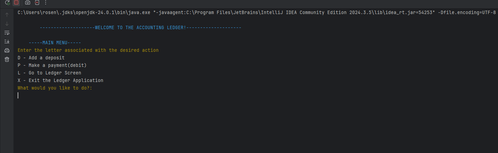
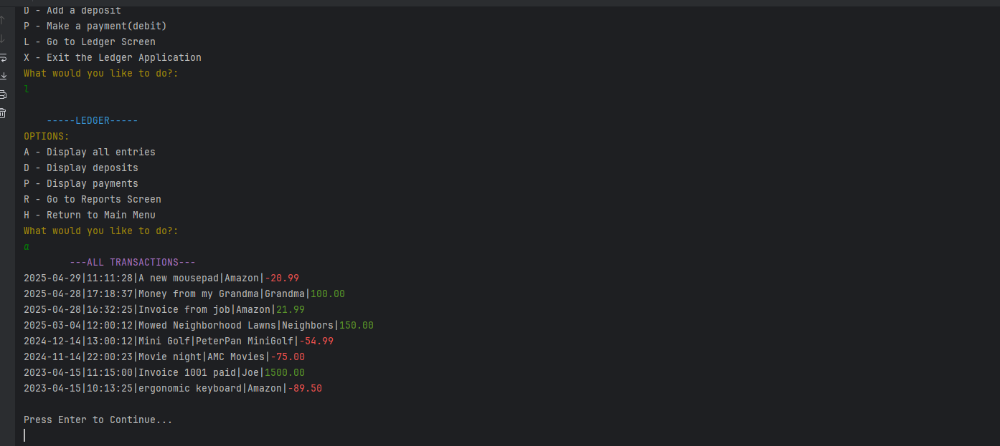
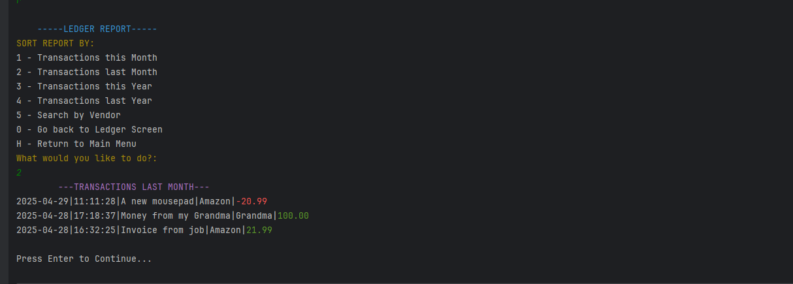

# Accounting Ledger

## Table of Contents
- [Description](#description)
- [Images](#images)
- [Usage](#usage)
- [Tests](#tests)
- [License](#license)
- [Contributing](#contributing)
- [Questions](#questions)

## Description
The Accounting Ledger application is a command line application, created using Java, that will log and display a users financial transactions. This application logs the date, time, description, vendor, and amount of a transaction. When displaying transactions, a user can customize the transactions that are displayed, and the payment amount is red and deposit amount is green. The application will also display newest transactions first and oldest last. 

This application contains 3 screens a user can navigate through: The Main Menu Screen, The Ledger Screen, and The Report Screen. 
____

#### Main Menu Screen
From the Main Menu Screen a user can add a deposit or payment, navigate to the ledger screen, or exit the application. When adding a payment or deposit the user is prompted for the description, vendor, and amount of the payment or deposit, and this data is logged. The time and date is automatically logged when the transaction is added.
#### Ledger Screen
From the Ledger Screen a user can display all of their transactions, display only their payments, or display only their deposits. A user can also navigate back to the Main Menu Screen, or navigate to the Report Screen.
#### Report Screen
From the Report Screen a user can display their transactions from the current month, the previous month, the current year, and the previous year. A user can also search a transaction by the name of the vendor. Lastly, a user can navigate back to the Ledger Screen, or navigate back to the Main Menu Screen.

## Images
#### Main Menu Screen

#### Displaying all Transactions in Ledger Screen

#### Displaying Last Month Transactions in Report Screen

## Usage
To Run the Application:
1) Clone the repository code to your local workspace.
2) Open the Main.java class (AccountingLedger/src/main/java/Main.java).
3) Run the Main.java class (Green arrow in the right corner)
4) Follow the prompts that are given and select the character that goes with your desired option.
5) Your transactions will appear in the command line.

## Tests
No tests are provided.

## License
There is no license for this application.

## Contributing
### Please contribute to this project:
- [Submit Bugs and Request Features you'd like to see Implemented](https://github.com/krosengr4/capstone-1/issues)

## Questions
- [Link to my Github Profile](https://github.com/krosengr4)

- For any additional questions, email me at rosenkev4@gmail.com
