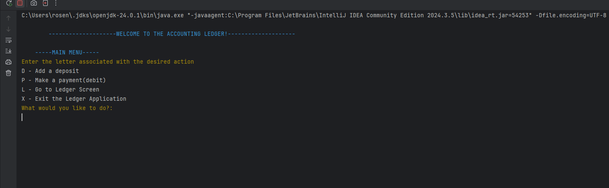
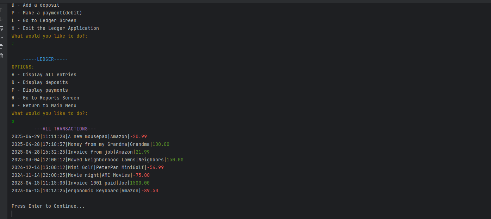

# Accounting Ledger

## Table of Contents
- [Description](#description)
- [Images](#images)
- [Usage](#usage)
- [Tests](#tests)
- [License](#license)
- [Contributing](#License)
- [Questions](#questions)

## Description
The Accounting Ledger application is a command line application that will log a users Deposits and Payments. A user can add deposits or payments, and
view their transactions based on deposits and payments, and the transactions this month, this year, previous month and previous year.

## Images
### Image 1:

### Image 2:

### Image 3:

## Usage
To Run the Application:
1) Clone the repository code to your local workspace.
2) Open the Main.java class (AccountingLedger/src/main/java/Main.java).
3) Run the Main.java class (Green arrow in the right corner)
4) Follow the prompts that are given and select the character that goes with your desired option.
5) Your transactions will appear in the CLI.

## Tests
No tests are provided.

## License
There is no license for this application.

## Please contribute to this project:
- [Submit Bugs and Request Features you'd like to see Implemented](https://github.com/krosengr4/capstone-1/issues)

## Questions
- [Link to my Github Profile](https://github.com/krosengr4)

- For any additional questions, email me at rosenkev4@gmail.com